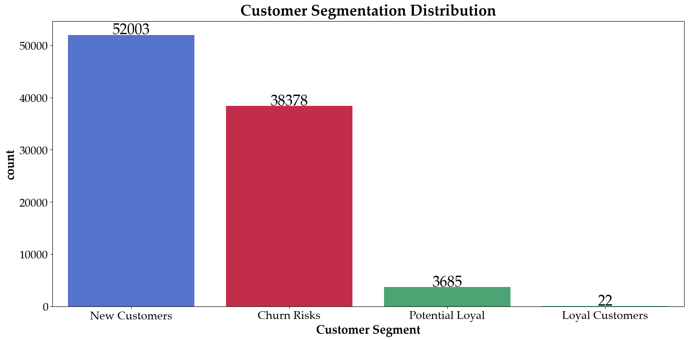
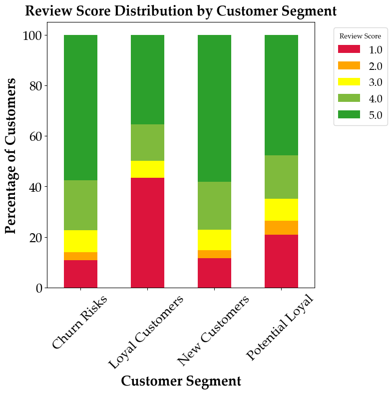
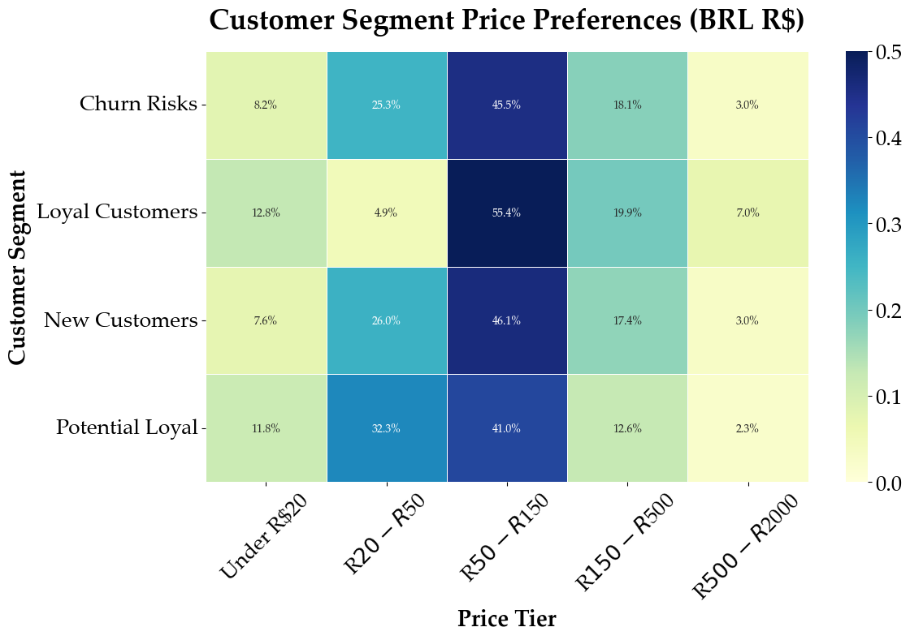
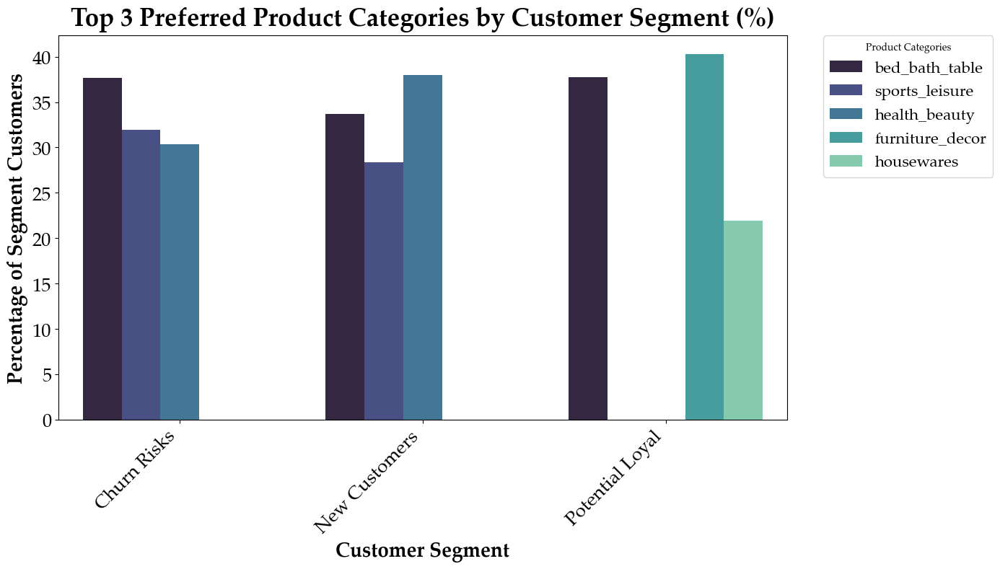

# E-commerce_Olist

The analysis conducted on Brazilian ecommerce public dataset (Olist Store), with information of 100k orders from 2016 to 2018.

## 1. Demographics:
--------------------------------------------------------------------------------------------------------------------------------------------------------------------
## 2. Customer Behaviour
## Approche: The Recency, Frequency, Monetary (RFM) model 
| **Tier**          | **Behavior Summary**                          |
|-------------------|-----------------------------------------------|
| **New Customers** | Customers with low engagement who have transacted recently        |
| **Potential Loyal** | Customers showing loyalty signals (Recent customers but with a good amount of spending/frequency) | 
| **Loyal Customers** | Frequent buyers with high lifetime value (had the highest total transactions/monetary value)| 
| **Churn Risks**   | Inactive customers who may not return   (Have made a transaction while ago with low frequency/monetary purchases)|
--------------------------------------------------------------------------------------------------------------------------------------------------------------------
### 2.1 K-means algorithim 

The "elbow" (optimal point) is where the curve bends—here, it occurs around 4-6 cluster. The Optimal points as SilhouetteMethod showed is 6 clusters. 4 clusters were chosen for simpler segmentation standared, given by:
| Cluster | Recency | Frequency | Monetary | **Tier**               |
|---------|---------|-----------|----------|-------------------------|
| 0       | 222.0   | 3.0       | 601.765  | **Potential Loyal**     |
| 1       | 135.0   | 1.0       | 109.500  | **New Customers**       |
| 2       | 227.5   | 10.0      | 8,716.88 | **Loyal Customers** |
| 3       | 382.0   | 1.0       | 106.970  | **Churn Risks**             |
---------------------------------------------------------------------------------------------------------------------------------------------------------------------
## Customer Segmentation 

## Customers beaviour based on their Segment:

---------------------------------------------------------------------------------------------------------------------------------------------------------------------
## Recommendation:
| **Tier**          | **Recommended Strategy**                     |
|-------------------|--------------------------------------------|
| **New Customers** | Welcome offers, second-purchase incentives, Retargeting (By ads) |
| **Potential Loyal** | Loyalty program enrollment, targeted deals,Urgency Tactics |
| **Loyal Customers** | VIP treatment, exclusive rewards, Asking for feedback  |
| **Churn Risks**   | Campaign via email, reactivation offers  |
## Data source
https://www.kaggle.com/datasets/olistbr/brazilian-ecommerce 
