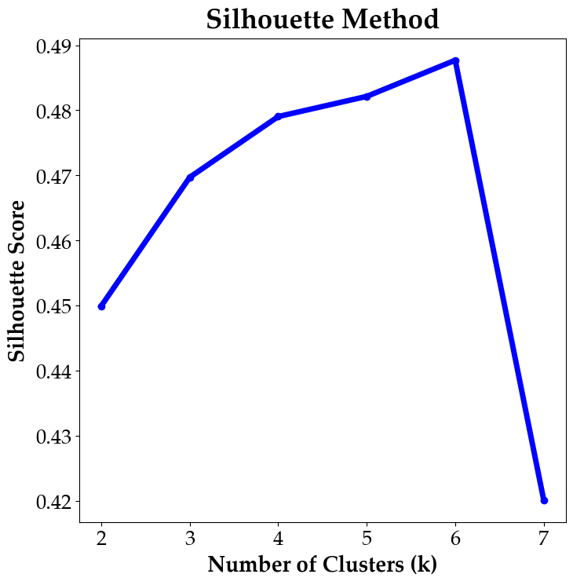
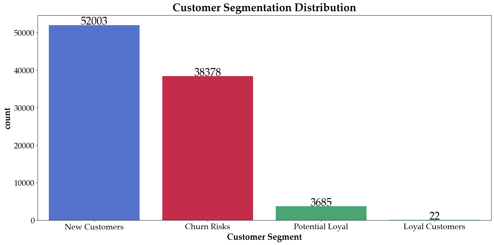

# E-commerce_Olist

The analysis conducted on Brazilian ecommerce public dataset (Olist Store), with information of 100k orders from 2016 to 2018.

## 1. Demographics:

## 2. Customer Behaviour

## Approche: The Recency, Frequency, Monetary (RFM) model 

### 2.1 K-means algorithim 

## Customer Segmentation 

## Customers beaviour based on their Segment:

## Recommendation:

## Data source
https://www.kaggle.com/datasets/olistbr/brazilian-ecommerce 
