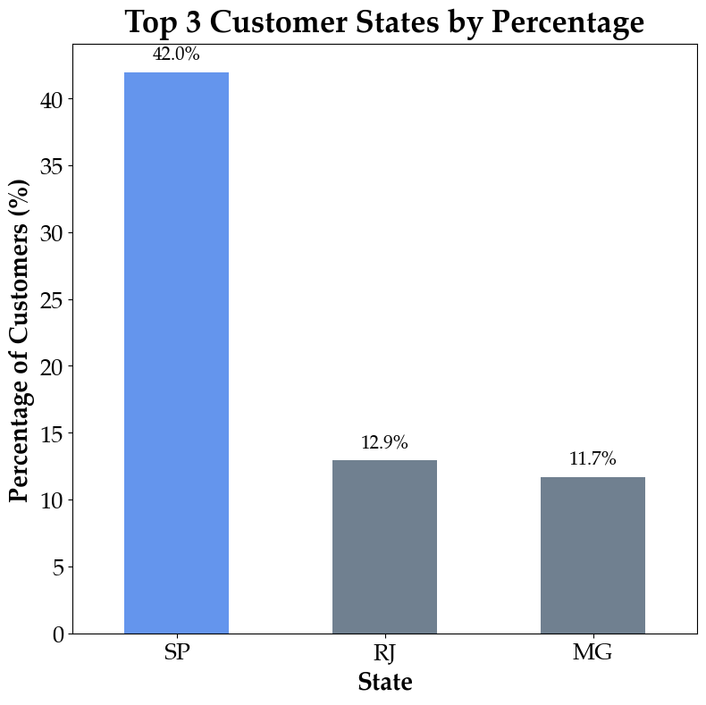

# 🛒 E-commerce Customer Segmentation - Olist Dataset

This project analyzes the Brazilian e-commerce public dataset from [Olist](https://www.kaggle.com/datasets/olistbr/brazilian-ecommerce), containing data on over **100,000 orders between 2016 and 2018**. The goal is to understand customer behavior and suggest data-driven marketing strategies.

---

## 📊 1. Demographics
São Paulo is the state with the dominated orders, 42% of the customer are from São Paulo state!

---

## 🔍 2. Customer Behavior Analysis

### Approach: **RFM Segmentation Model**

Using the **Recency, Frequency, and Monetary (RFM)** model to classify customers based on their interaction with the platform.

| **Tier**             | **Behavior Summary**                                                                 |
|----------------------|----------------------------------------------------------------------------------------|
| **New Customers**       | Recently active customers with low engagement or spending.                        |
| **Potential Loyalists** | Customers who show signs of loyalty — recent activity with decent frequency/value. |
| **Loyal Customers**     | High-value, frequent buyers with strong lifetime value.                            |
| **Churn Risks**         | Inactive or infrequent customers with low monetary value.                          |

---

### 2.1 🧠 Clustering with K-Means

To refine segmentation, we applied the K-Means clustering algorithm on the RFM features.

**Optimal Clusters (Silhouette Method):**  
Although 6 clusters showed the highest silhouette score, we opted for 4 clusters to simplify analysis.

| **Cluster** | **Recency** | **Frequency** | **Monetary** | **Assigned Tier**        |
|-------------|-------------|---------------|--------------|---------------------------|
| 0           | 222.0       | 3.0           | 601.77       | Potential Loyalists     |
| 1           | 135.0       | 1.0           | 109.50       | New Customers           |
| 2           | 227.5       | 10.0          | 8,716.88     | Loyal Customers         |
| 3           | 382.0       | 1.0           | 106.97       | Churn Risks             |

---

## 🎯 3. Customer Segmentation

Visual representation of customer clusters and key behavior differences:

- **Satisfaction Levels**
- **Price Sensitivity**
- **Product Preferences**

---

## 💡 4. Strategic Recommendations

Based on the segmentation, a recommended tailored marketing strategies:

| **Customer Tier**      | **Recommended Actions**                                                                 |
|------------------------|------------------------------------------------------------------------------------------|
| New Customers        | Welcome emails, second-purchase discounts, retargeting via ads                          |
| Potential Loyalists  | Personalized deals, urgency tactics (limited-time offers), loyalty program invitation   |
| Loyal Customers      | Exclusive offers, VIP rewards, gather feedback to increase retention                    |
| Churn Risks          | Reactivation campaigns, special comeback deals via email or SMS                         |

---

## 🗂️ Data Source

📥 Dataset: [Brazilian E-Commerce Public Dataset by Olist (Kaggle)](https://www.kaggle.com/datasets/olistbr/brazilian-ecommerce)
